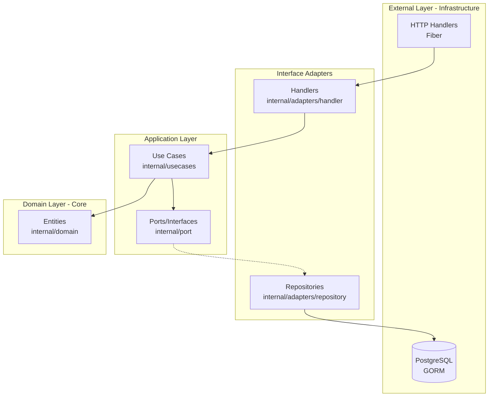

# 🛒 E-Commerce REST API

[](https://golang.org/)
[](https://blog.cleancoder.com/uncle-bob/2012/08/13/the-clean-architecture.html)

A **production-ready** RESTful API for an e-commerce platform built with **Go (Golang)** following **Clean Architecture** (Hexagonal Architecture) principles. This project demonstrates best practices in API design, authentication, and modular software architecture.

## 📋 Table of Contents

- [Features](#-features)
- [Tech Stack](#-tech-stack)
- [Architecture](#-architecture)
- [Project Structure](#-project-structure)
- [Getting Started](#-getting-started)
- [API Documentation](#-api-documentation)
- [Testing](#-testing)
- [Deployment](#-deployment)

---

## ✨ Features

- 🔐 **JWT Authentication** - Secure user authentication with role-based access control (RBAC)
- 👤 **User Management** - Registration, login, profile management, password change
- 📦 **Product Catalog** - Full CRUD operations with category management
- 🛒 **Shopping Cart** - Complete cart functionality (add, update, remove, clear)
- 📋 **Order System** - Checkout flow, order tracking, and cancellation
- 🏗️ **Clean Architecture** - Maintainable, testable, and scalable codebase
- 🐳 **Docker Ready** - Containerized development and production environments
- ⚡ **High Performance** - Built on Fiber (fastest Go HTTP framework)

---

## 🛠 Tech Stack

| Category | Technology |
|----------|------------|
| **Language** | Go 1.23+ |
| **Framework** | [Fiber v2](https://gofiber.io/) - Express-inspired web framework |
| **Database** | PostgreSQL 15+ |
| **ORM** | [GORM](https://gorm.io/) - Full-featured ORM |
| **Authentication** | JWT (golang-jwt/jwt) |
| **Password Hashing** | bcrypt |
| **Configuration** | godotenv |
| **Containerization** | Docker & Docker Compose |

---

## 🏗️ Architecture

This project follows **Clean Architecture** (also known as Hexagonal/Ports & Adapters Architecture), ensuring:

- **Independence from frameworks** - Business logic doesn't depend on external libraries
- **Testability** - Business rules can be tested without UI, database, or external services
- **Independence from UI** - The API can change without affecting business rules
- **Independence from Database** - PostgreSQL can be swapped for any other database

### Architecture Diagram



### Dependency Flow

```
┌─────────────────────────────────────────────────────────────┐
│                     HTTP Request                            │
└─────────────────────────────────────────────────────────────┘
                              │
                              ▼
┌─────────────────────────────────────────────────────────────┐
│  Handlers (Adapters)           - Request/Response handling  │
│  /internal/adapters/handler    - Input validation           │
└─────────────────────────────────────────────────────────────┘
                              │
                              ▼
┌─────────────────────────────────────────────────────────────┐
│  Use Cases (Business Logic)    - Business rules             │
│  /internal/usecases            - Orchestration              │
└─────────────────────────────────────────────────────────────┘
                              │
                              ▼
┌─────────────────────────────────────────────────────────────┐
│  Ports (Interfaces)            - Contracts                  │
│  /internal/port                - Dependency inversion       │
└─────────────────────────────────────────────────────────────┘
                              │
                              ▼
┌─────────────────────────────────────────────────────────────┐
│  Domain (Entities)             - Core business models       │
│  /internal/domain              - No external dependencies   │
└─────────────────────────────────────────────────────────────┘
```

---

## 📁 Project Structure

```
E-Commerce_API/
├── cmd/
│   └── api/
│       └── main.go              # Application entry point
├── internal/                    # Private application code
│   ├── adapters/
│   │   ├── handler/             # HTTP handlers (Fiber)
│   │   └── repository/          # Database implementations (GORM)
│   ├── domain/                  # Business entities
│   ├── middleware/              # Auth & request middleware
│   ├── port/                    # Interfaces (Repository contracts)
│   └── usecases/                # Business logic layer
├── infrastructure/              # External concerns
│   ├── config/                  # Configuration management
│   ├── container/               # Dependency injection
│   ├── routes/                  # Route definitions
│   └── server/                  # Fiber server setup
├── migrations/                  # Database migrations & seeds
├── pkg/                         # Shared utilities
│   └── hash/                    # Password hashing
├── docker-compose.yml           # Docker services
├── Makefile                     # Build automation
├── .env.example                 # Environment template
└── README.md                    # This file
```

---

## 🚀 Getting Started

### Prerequisites

- **Go 1.23+** - [Download](https://golang.org/dl/)
- **PostgreSQL 15+** - Or use Docker
- **Docker & Docker Compose** (optional but recommended)

### Quick Start with Docker

```bash
# 1. Clone the repository
git clone https://github.com/Fal2o/E-Commerce_API.git
cd E-Commerce_API

# 2. Copy environment file
cp .env.example .env

# 3. Start PostgreSQL with Docker
docker-compose up -d

# 4. Run database migrations and seed
go run cmd/api/main.go -seed

# 5. Start the API server
go run cmd/api/main.go
```

### Local Development Setup

```bash
# 1. Install dependencies
go mod download

# 2. Configure environment variables
cp .env.example .env
# Edit .env with your database credentials

# 3. Start PostgreSQL (if not using Docker)
# Ensure PostgreSQL is running on localhost:5432

# 4. Run migrations and seed data
make seed

# 5. Start the server
go run cmd/api/main.go
```

### Environment Variables

| Variable | Description | Default |
|----------|-------------|---------|
| `DB_HOST` | Database host | `localhost` |
| `DB_PORT` | Database port | `5432` |
| `DB_USER` | Database user | `myuser` |
| `DB_PASSWORD` | Database password | `mypassword` |
| `DB_NAME` | Database name | `mydatabase` |
| `DB_SSL_MODE` | SSL mode | `disable` |
| `SERVER_PORT` | API server port | `8000` |
| `JWT_SECRET` | JWT signing key | **(Change in production!)** |
| `JWT_EXPIRATION` | Token expiration | `72h` |
| `ENVIRONMENT` | Environment mode | `development` |

---

## 📚 API Documentation

### Base URL
```
http://localhost:8000/api/v1
```

### Authentication

Most endpoints require JWT authentication. Include the token in the Authorization header:
```
Authorization: Bearer <your-jwt-token>
```

### Endpoints Overview

#### Public Endpoints (No Auth Required)

| Method | Endpoint | Description |
|--------|----------|-------------|
| `POST` | `/register` | User registration |
| `POST` | `/login` | User login (returns JWT) |
| `GET` | `/products` | List all products |
| `GET` | `/product/:name` | Search product by name |
| `GET` | `/productBy/cat/:category` | Filter products by category |

#### User Endpoints (Auth Required)

| Method | Endpoint | Description |
|--------|----------|-------------|
| `GET` | `/user/profile` | Get current user profile |
| `PUT` | `/user/profile` | Update profile/password |
| `GET` | `/user/cart` | View cart contents |
| `POST` | `/user/cart/item/:product_id` | Add product to cart |
| `DELETE` | `/user/cart/:product_id` | Remove/decrease item |
| `DELETE` | `/user/cart/cancel` | Clear entire cart |
| `POST` | `/user/cart/checkout` | Checkout cart |
| `GET` | `/user/orders` | View user orders |
| `DELETE` | `/user/order/cancel/:orderID` | Cancel order |

#### Admin Endpoints (Admin Auth Required)

| Method | Endpoint | Description |
|--------|----------|-------------|
| `POST` | `/admin/product` | Create product |
| `PUT` | `/admin/product/:id` | Update product |
| `DELETE` | `/admin/product/:id` | Delete product |
| `POST` | `/admin/category` | Create category |
| `PUT` | `/admin/category/:id` | Update category |
| `DELETE` | `/admin/category/:id` | Delete category |
| `GET` | `/admin/users` | List all users |
| `GET` | `/admin/orders` | List all orders |
| `PUT` | `/admin/order/status/:orderID/:status` | Update order status |

### Example Requests

#### Register User
```bash
curl -X POST http://localhost:8000/api/v1/register \
  -H "Content-Type: application/json" \
  -d '{
    "email": "user@example.com",
    "password": "securepass123",
    "username": "johndoe",
    "role": "user"
  }'
```

#### Login
```bash
curl -X POST http://localhost:8000/api/v1/login \
  -H "Content-Type: application/json" \
  -d '{
    "email": "user@example.com",
    "password": "securepass123"
  }'
```

#### Add to Cart (Authenticated)
```bash
curl -X POST http://localhost:8000/api/v1/user/cart/item/1 \
  -H "Authorization: Bearer <your-jwt-token>"
```

---

## 🐳 Deployment

### Docker Production Build

```bash
# Multi-stage build (see Dockerfile)
docker build -t ecommerce-api:latest .
docker run -p 8000:8000 --env-file .env ecommerce-api:latest
```

### Using Docker Compose

```bash
docker-compose up -d
```

---

## 👤 Author

**Fal2o**

- GitHub: [@Fal2o](https://github.com/Fal2o)